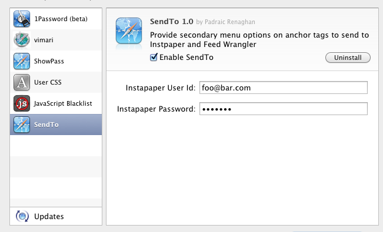
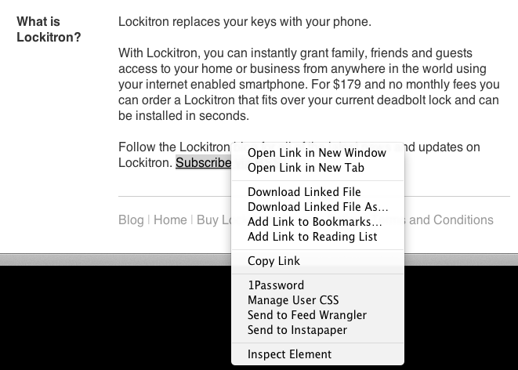

SendToExtension
===============

Safari Extension to provide secondary menu options on anchor tags to send to Instpaper and Feed Wrangler

The extension interface is through the context menu in Safari. When on a page in Safari trigger the context menu. The extension will attempt to find the "best" URL searching for the following in order:

1. The target of the context menu, if it is an anchor or is enclosed by an anchor, and that anchor has an href attribute

2. The link element relative with a type that appears to be an RSS feed

3. The URL of the page itself

Installation
============

Download and install the SendTo Safari Extension

After installing in Safari visit Preferences, Extensions, SendTo and
enter your Instapaper user name and password (if you use them).

Screenshots
===========

